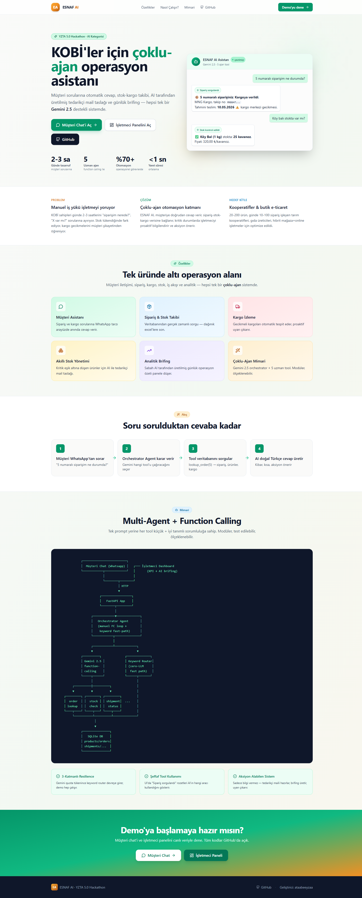
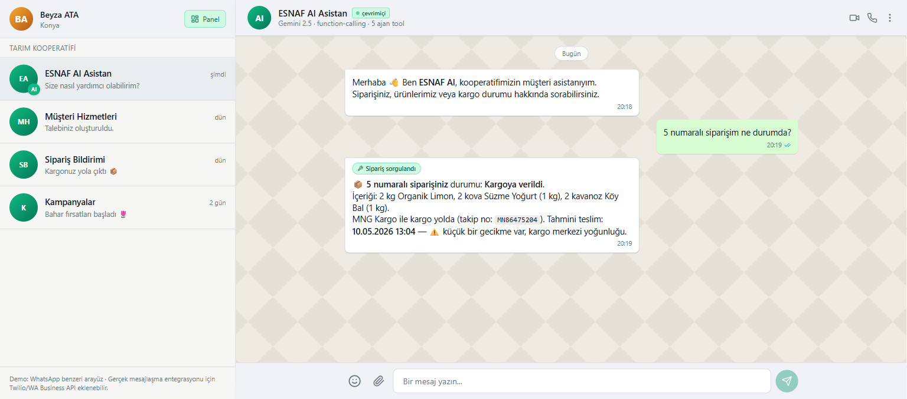
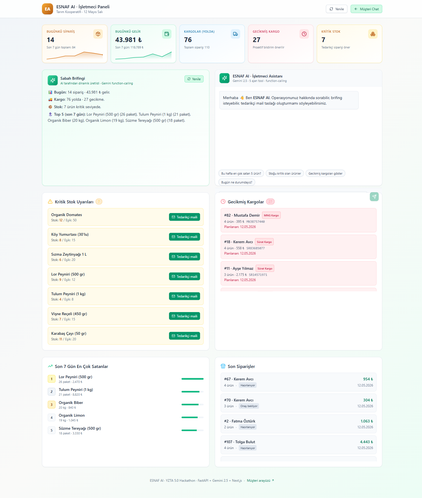

# Çırak — Esnafın Yapay Zeka Çırağı

KOBİ ve kooperatifler için çoklu-ajan operasyon asistanı. Müşteri sorularına cevap veriyor, stoku izliyor, kargoyu takip ediyor, yeni sipariş alıyor, tedarikçi maili hazırlıyor, günlük brifing üretiyor — hepsi tek bir sistemde.

*(Repo adı `esnaf-ai` olarak kaldı, proje adını sonradan **Çırak** yaptım. Eski URL bozulmasın diye repo adına dokunmadım.)*

YZTA 5.0 Hackathon · AI Geliştirme · Teslim 13 Mayıs 2026.

**Canlı demo:**

- Landing: <https://esnaf-ai-ten.vercel.app>
- Müşteri chat: <https://esnaf-ai-ten.vercel.app/chat>
- İşletmeci paneli: <https://esnaf-ai-ten.vercel.app/dashboard>
- Tedarikçi portalı: <https://esnaf-ai-ten.vercel.app/supplier-portal>
- Kargo paneli: <https://esnaf-ai-ten.vercel.app/carrier-portal>
- WhatsApp demo: <https://esnaf-ai-ten.vercel.app/whatsapp-demo>
- Backend API: <https://esnaf-ai-backend.onrender.com> · [/docs](https://esnaf-ai-backend.onrender.com/docs)

GitHub: <https://github.com/ataabeeyzaa/esnaf-ai> · YouTube demo videosu teslimden önce eklenecek.

> Backend Render free tier'da, 15 dk trafiksiz kalırsa uykuya geçiyor. Demo öncesi `/health`'e bir istek atıp uyandırmak gerek (~50 sn).

### Sayfalar

- `/` — landing, mimari diyagram, üç ana CTA
- `/chat` — müşteri için WhatsApp benzeri arayüz. Sol menüde Çırak'ın yanı sıra sipariş bildirimleri, kampanyalar ve SSS sekmeleri var
- `/dashboard` — işletmeci için KPI'lar, AI sabah brifingi, kritik stok ve gecikmiş kargolar, embedded AI asistan
- `/whatsapp-demo` — QR kod + telefon mockup'ı ile WhatsApp entegrasyonunun nasıl görüneceği
- `/supplier-portal` — Çırak'ın gönderdiği mailleri tedarikçinin gözünden gösteren Gmail-tarzı inbox
- `/carrier-portal` — kargo şirketinin/kuryenin teslim edilecek kargo listesi; "Teslim ettim" butonu Çırak'a webhook gönderir

---

## Problem

KOBİ ve kooperatifler hâlâ günde 2-3 saatlerini "siparişim nerede?", "domates kaldı mı?" gibi tekrar eden müşteri sorularını yanıtlamakla geçiriyor. Stok genelde tükendikten sonra fark ediliyor, kargo gecikmesini de işletmeci müşteri şikayetinden öğreniyor, tedarikçiye mail yazmak akşamlara kalıyor.

## Çözüm

Çırak bu sürecin tamamını tek bir orchestrator agent'a topluyor. Gemini 2.5 mesajı okuyor, hangi tool'un çağrılması gerektiğine karar veriyor (sipariş sorgula, stok kontrol et, sipariş aç, mail taslağı hazırla, kargo izle, brifing üret), gerçek veritabanı işlemini yapıyor ve cevabı Türkçe veriyor. Hem müşteri tarafı WhatsApp benzeri bir chat'le konuşuyor hem de işletmeci kendi panelinden aynı agent'a soru sorabiliyor.

Bir not: tedarikçi maili yazma, gecikmiş kargolar için toplu bildirim, sabah brifingi gibi şeyler "AI sadece konuşur" değil "AI aksiyon alır" tarafında — gerçek veritabanı yazımı veya hazır mail taslağı çıkıyor.

Bir de Gemini quota'sı dolarsa diye üç katmanlı bir yedek planım var: fallback model, tool-result'tan template cevap üretme, son çare olarak keyword router. Demo gün ortasında Gemini patlasa bile durmuyor.

**Kargonun teslim edildiğini sistem nasıl anlıyor?** Gerçek hayatta kargo şirketinin webhook'u — Yurtiçi/Aras/MNG teslim edildiğinde bizim backend'e bir POST atar, biz de DB'yi güncelleriz. Demo'da bu webhook yok, onun yerine basit bir simülasyon koydum: dashboard her yenilendiğinde ETA'sı 12 saat öncesi geçmiş "yolda" kargolar otomatik teslim edildi sayılıyor ve gecikmiş listesinden çıkıyor. Manuel ilerletme butonu da dashboard'da duruyor.

## Ekran görüntüleri

**Landing sayfası** — `/` — hero, özellik kartları, akış diyagramı, mimari diyagram, 3 CTA:



**Müşteri Chat (WhatsApp tarzı)** — `/chat` — sipariş sorgusu + AI'ın `lookup_order` tool'unu kullanması (yeşil "Sipariş sorgulandı" rozeti):



**İşletmeci Dashboard** — `/dashboard` — animasyonlu KPI sayıcılar + sparkline trendler, AI sabah brifingi, embedded AI chat, kritik stok uyarıları (tek tıkla tedarikçi maili), gecikmiş kargolar, top 5 satıcı, tıklanabilir son siparişler:



## Demo senaryoları

Senaryoların hepsi gerçek DB'de çalışıyor, scripted cevap değil.

| # | Kullanıcı | Mesaj | AI Yaptığı | Tool | Görsel İpucu |
|---|---|---|---|---|---|
| 1 | Müşteri | "5 numaralı siparişim ne durumda?" | Siparişi bulur, kargo durumu + ETA + gecikme tespiti | `lookup_order` | Mesajda yeşil rozet "Sipariş sorgulandı" |
| 2 | Müşteri | "3 kg organik domates almak istiyorum" | **Gerçek DB'de yeni sipariş açar**, kargo etiketi oluşturur, sipariş ID döner | `place_order` | **Koyu yeşil pulse rozet** "✓ Yeni sipariş oluşturuldu #142" |
| 3 | Müşteri | "Köy balı stokta var mı?" | Fuzzy ürün arama, stok + birim fiyat | `check_stock` | Mesajda "Stok kontrol edildi" rozeti |
| 4 | İşletmeci | "Bugün ne durumdayız?" | Sabah brifingi: siparişler, gelir, gecikmeler, kritik stoklar, top satıcılar | `daily_briefing` | Dashboard'da yeşil pulse "Otomatik · 08:00" rozeti |
| 5 | İşletmeci | Kritik stok kartında "Tedarikçi maili" tıklar | 14 günlük satışa bakar, miktar önerir, Türkçe mail taslağı hazırlar | `check_stock` + `draft_supplier_email` | Modal'da hazır mail taslağı |
| 6 | İşletmeci | Gecikmiş kargolar kartında "Tümünü Bilgilendir" tıklar | Her gecikmiş sipariş için kişiselleştirilmiş AI bildirim taslağı | toplu bulk endpoint | Modal'da müşteri başına ayrı mesaj |
| 7 | İşletmeci | ForecastCard'a bakar | 14 günlük satış hızıyla tükenme tahmini + önümüzdeki 7 günde liderler | `/dashboard/forecast` | Violet bar chart top 5 liderler |

### 🎬 1 dakikalık demo akış önerisi (jüri için)

```
00:00-00:10  Problem cümlesi: "KOBİ günde 2-3 saatini tekrarlayan sorulara harcıyor."
00:10-00:25  /chat → "5 numaralı siparişim?" → AI lookup_order → kargo durumu döner
00:25-00:40  /chat → "3 kg domates almak istiyorum" → AI place_order → "✓ Sipariş oluşturuldu"
             (Bu kısımda jüriye söyle: "Bu sadece konuşmuyor, gerçekten DB'ye yazıyor.")
00:40-00:50  /dashboard → kritik stok → "Tedarikçi maili" → AI 14 günlük satışa bakar
00:50-01:00  3-katmanlı resilience cümlesi: "Gemini quota dolsa bile keyword router devreye girer, demo durmaz."
```

### Hangi tema alanları kapsanıyor

| Tema | Hangi senaryo |
|---|---|
| 1 — Müşteri iletişimi otomasyonu | Senaryo 1, 2, 3 |
| 2 — Ürün ve sipariş takibi | Senaryo 1, 2, 4 |
| 3 — Kargo süreçleri | Senaryo 1, 6 |
| 4 — Stok ve envanter | Senaryo 5, 7 |
| 5 — İş akışı (otomasyon) | Senaryo 4 ("Otomatik · 08:00" rozet + production'da APScheduler) |
| 6 — Analitik ve içgörü (opsiyonel) | Senaryo 7 (ForecastCard top 5 liderler) |

## Mimari

```
Müşteri Chat (WhatsApp-tarzı)        İşletmeci Dashboard (KPI + AI)
       │                                       │
       └───────────┬───────────────────────────┘
                   │ HTTP/JSON
                   ▼
           FastAPI (Python 3.11)
                   │
        Orchestrator Agent (manuel FC loop)
                   │
              Gemini 2.5
       ┌─────┬─────┼─────┬─────┐
       ▼     ▼     ▼     ▼     ▼
   order  stock shipment mail brief
       └─────┴─────┼─────┴─────┘
                   ▼
              SQLite DB
```

Detaylı: [docs/architecture.md](docs/architecture.md) · Spec: [docs/specs/2026-05-12-esnaf-ai-design.md](docs/specs/2026-05-12-esnaf-ai-design.md)

## Kurulum

### 1. Repo'yu klonla

```bash
git clone https://github.com/ataabeeyzaa/esnaf-ai.git
cd esnaf-ai
```

### 2. Gemini API Key al

[aistudio.google.com/app/apikey](https://aistudio.google.com/app/apikey) → "Create API key" (ücretsiz)

`.env.example`'i `.env` olarak kopyala, key'i yapıştır:

```bash
cp .env.example .env
# .env içinde GEMINI_API_KEY=... satırını güncelle
```

### 3. Backend (FastAPI)

```bash
cd backend
python -m venv .venv
source .venv/Scripts/activate    # Windows PowerShell: .venv\Scripts\Activate.ps1
pip install -r requirements.txt
python -m app.seed                # SQLite + 35 ürün + 110 sipariş yükle
uvicorn app.main:app --reload
```

Backend: http://localhost:8000 · API dokümanı: http://localhost:8000/docs

### 4. Frontend (Next.js)

Yeni terminal:

```bash
cd frontend
npm install
npm run dev
```

- Frontend landing: http://localhost:3000
- Müşteri chat: http://localhost:3000/chat
- İşletmeci paneli: http://localhost:3000/dashboard

## Hızlı test

Backend'e doğrudan istek:

```bash
curl -X POST http://localhost:8000/chat/customer \
  -H "Content-Type: application/json" \
  -d '{"message": "5 numaralı siparişim ne durumda?"}'
```

Beklenen cevap: AI siparişi DB'den çeker, kargo durumunu söyler.

## Teknoloji yığını

| Katman | Teknoloji |
|--------|-----------|
| Backend | FastAPI 0.115 · Python 3.11 · SQLAlchemy 2.0 · SQLite |
| AI | Google Gemini 2.5 Flash Lite (öncelik), 2.0 Flash (fallback) |
| AI SDK | `google-genai` >= 1.0 (manuel function-calling loop) |
| Frontend | Next.js 14 App Router · TypeScript · Tailwind CSS |
| UI | shadcn benzeri özel komponentler · lucide-react ikonlar · react-markdown |

## Klasör yapısı

```
esnaf-ai/
├── backend/
│   ├── app/
│   │   ├── main.py              # FastAPI app
│   │   ├── config.py            # pydantic-settings
│   │   ├── db.py                # SQLAlchemy setup
│   │   ├── models.py            # ORM tabloları
│   │   ├── schemas.py           # Pydantic response modelleri
│   │   ├── seed.py              # Mock data
│   │   ├── agents/
│   │   │   ├── orchestrator.py  # Manuel FC loop + retry/fallback
│   │   │   └── tools.py         # 5 tool fonksiyonu
│   │   └── routes/
│   │       ├── chat.py          # /chat/customer, /chat/owner
│   │       └── dashboard.py     # /dashboard/summary vb.
│   ├── requirements.txt
│   └── README.md
├── frontend/
│   ├── app/
│   │   ├── page.tsx             # Müşteri chat
│   │   ├── dashboard/page.tsx   # İşletmeci paneli
│   │   ├── layout.tsx
│   │   └── globals.css
│   ├── components/
│   │   ├── MessageBubble.tsx
│   │   ├── TypingIndicator.tsx
│   │   ├── KpiCard.tsx
│   │   ├── OwnerChat.tsx
│   │   └── SupplierEmailModal.tsx
│   ├── lib/api.ts
│   └── package.json
├── docs/
│   ├── architecture.md
│   └── specs/2026-05-12-esnaf-ai-design.md
├── scripts/start_dev.ps1        # Backend + frontend birlikte
├── .env.example
└── README.md (bu dosya)
```


## Geliştirici

**ataabeeyzaa** — solo geliştirici (5 kişilik takım yerine).

GitHub: [@ataabeeyzaa](https://github.com/ataabeeyzaa)

## Lisans

Eğitim ve hackathon amaçlıdır.

---

*Bu proje YZTA 5.0 Hackathon'u kapsamında geliştirilmiştir. Kullanılan tüm AI modelleri ve kütüphaneler [docs/architecture.md](docs/architecture.md) içinde belirtilmiştir.*
